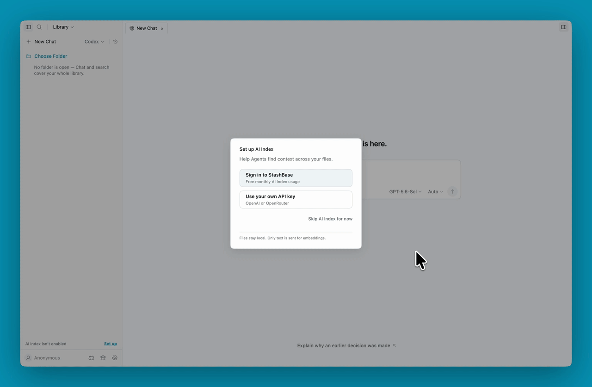

# StashBase

**Turn your local files into a Wiki for your agents.**

[](https://stashbase.ai)
[](https://github.com/liliu-z/stashbase/releases/latest)
[](#status)
[](LICENSE)
[](https://discord.gg/zsRZH4PTq9)

StashBase is an open-source, local-first app that helps your agents find and
reuse context across personal notes, research libraries, project docs, and
knowledge bases.

Build linked Markdown Wiki Pages from your sources, make difficult formats
searchable, and work with OpenQuill, Claude Code, Codex, or other MCP clients.
Your original files stay in place, and the Wiki Pages remain ordinary files
you own.

## Demo

Browse local sources and work with an Agent in the same workspace. This demo
uses the bundled guides to answer **“How do I use StashBase?”**



## From Files to Context

Giving an Agent access to a folder is a starting point. Useful evidence may be
buried in a long document, use different words from your question, or live in a
scan or recording. StashBase helps turn that material into reusable context:

- **Build a Wiki from your sources.** Ask an Agent to create a linked overview
  and focused pages that explain what's inside, with links back to the original
  files. Those pages become context for later work.
- **Find the material that matters.** Search by meaning alongside keyword
  search, with text extracted from PDFs, DOCX files, images, and recordings.
  Results lead back to the source files.
- **Work with your agents.** Use the included OpenQuill, bring Claude Code or
  Codex into Chat, or connect an external MCP client to the same library.
- **Keep your files yours.** Browse, read, and edit supported files alongside
  the conversation. Sources keep their original layout; Wiki Pages are visible
  Markdown you can open and use outside StashBase.

## Get Started

**macOS 12+ (Apple Silicon)** and **Windows 10+ (x64)** are the primary
platforms. Linux x86_64 Debian 12+ / Ubuntu 22.04+ is community-supported.

On macOS, install with Homebrew:

```bash
brew install --cask liliu-z/stashbase/stashbase
```

Or [download the latest release](https://github.com/liliu-z/stashbase/releases/latest):

| Platform | Download |
|---|---|
| macOS Apple Silicon | `StashBase-*-mac-arm64.dmg` |
| Windows x64 | `StashBase-*-win-x64.exe` |
| Linux x86_64 | `StashBase-*-linux-amd64.deb` or `.AppImage` |

See [Installation](docs/installation.md) for platform steps, updates, and
troubleshooting.

### Build Your First Wiki

1. **Choose your material.** Open your own folder, or explore the Gallery in
   the app and choose **Make a copy** to download and open a ready-made Wiki.
2. **Choose an Agent.** OpenQuill is included and selected initially; sign in
   to StashBase to use its included model allowance. You can also select
   Claude Code or Codex and use your own provider account.
3. **Build and use the Wiki.** In a Chat scoped to your folder, try:

   > Build a Wiki from the sources in this folder. Create an overview, organize
   > the main topics, and link back to the source files.

   Then ask a question about the material, open its sources beside the Chat,
   and ask the Agent to improve the pages as you learn more.

A Build Wiki request creates or improves `wiki/index.md` and, when useful,
pages beside it, preserving Sources outside `wiki/`. Building or updating
these pages is an explicit Agent request; opening a folder does not
schedule automatic Wiki maintenance.

The first folder offers setup for **search by meaning**. You can use StashBase
sign-in with included monthly credits or your own OpenAI/OpenRouter key.
Choose **Not now** to continue with keyword search. This setup is independent
of building Wiki Pages and can be completed later in Settings.

See [Using StashBase](docs/using-stashbase.md) for search, transcription, and
everyday file workflows. You can also ask Chat **“How do I use StashBase?”**

## Explore the Gallery

Start with a real folder that already has a Wiki built from it. Gallery entries
include starter prompts, and entries with a build request let you copy it for
your own material.

For example, [How to Start a Startup](https://stashbase.ai/examples/cs183b/)
brings together Stanford CS183B lecture transcripts and a founder playbook.
Use it to explore questions about startup ideas, product-market fit, and growth.

Your own starting point might be a research collection, project documents, or
personal notes. Build an overview of the topics, decisions, and sources, then
use it with your Agent as the work continues.

[Explore the Gallery →](https://stashbase.ai/gallery/)

## Your Files and Your Data

Sources and Wiki Pages stay in ordinary local folders. Extracted text and
search indexes are app-managed data. Removing a folder from the Library clears
StashBase's state for it without deleting your files.

Local browsing, editing, preview, and keyword search need no cloud account.
OCR and optional audio/video transcription run locally. Hosted search by
meaning sends relevant text to the selected embedding provider for indexing
and queries for retrieval.

OpenQuill runs locally, with prompts and necessary model context sent through
StashBase's hosted model gateway. Claude Code and Codex use their own provider
accounts. Local-first means you retain your files and control which folders
join the Library; model-backed features can still use cloud services.

## Connect Your Agents

StashBase configures its MCP connection automatically for OpenQuill and for
Claude Code or Codex used in the built-in Chat. You can review tool calls and
file edits in the app.

To use an external MCP client, keep StashBase running and copy the connection
configuration from **Settings → MCP** into that client. It can search the
library, read prepared source content, and use bounded file operations within
the authorized folders.

See [MCP Configuration](docs/mcp-configuration.md) for client examples,
transports, and access settings.

## Build From Source

For contributors and developers running StashBase locally from source.

Install Node.js 24+, pnpm, and Python 3.10+. On Ubuntu / Debian, install
the native build tools used by the packaged sidecars:

```bash
sudo apt install build-essential binutils cmake curl git nasm pkg-config python3 python3-venv xz-utils
```

```bash
git clone https://github.com/liliu-z/stashbase
cd stashbase
pnpm install
pnpm setup:python

# Optional: local PDF and image OCR extraction from this checkout
pnpm setup:python-extract

# Build the renderer and run Electron
pnpm build:web
env -u ELECTRON_RUN_AS_NODE pnpm electron

# Development mode
env -u ELECTRON_RUN_AS_NODE pnpm dev

# Optional: include the local PDF/OCR extractor sidecar
pnpm build:python-extract-sidecar
```

The launch commands above use POSIX shell syntax to clear an inherited
`ELECTRON_RUN_AS_NODE`. On Windows, clear that variable in your shell before
running `pnpm electron` or `pnpm dev`.

Before opening a PR:

```bash
pnpm check
```

Packaging is release-only and runs from a validated release tag. Maintainers
should follow the [release pipeline](code-review/release-pipeline.md) instead
of creating ad hoc distributable builds.

---

## Contributing

StashBase is also an experiment in human-directed, AI-first development.
Humans own product direction and trust decisions; AI helps connect design,
implementation, review, and evidence. The
[Project Maintenance Model](MAINTENANCE.md) describes that working loop.

Small focused PRs are preferred. Open an issue before larger changes so scope
and direction can be discussed first.

- [Contributing guide](CONTRIBUTING.md) — development and validation.
- [Product design](design-docs/README.md) — intent, workflows, and contribution areas.
- [Engineering contracts](code-review/README.md) — ownership, invariants, and review.

## Status

**Early alpha.** Feedback and contributions are welcome, especially around
Agent workflows, search quality, preparation and recovery, and cross-platform
reliability.

[Report an issue](https://github.com/liliu-z/stashbase/issues) or
[join the Discord community](https://discord.gg/zsRZH4PTq9) for support and discussion.

## About

StashBase is an independent open-source project built by
[Li Liu](https://github.com/liliu-z), bringing vector-retrieval experience to
making local knowledge useful to Agents.

Licensed under [Apache 2.0](LICENSE).
