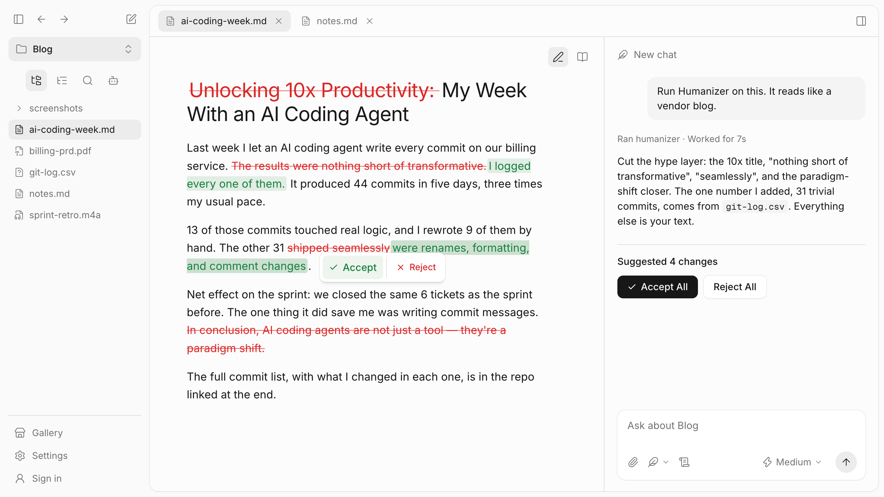

# StashBase

**Like an IDE, but for writing.**

[](https://stashbase.ai)
[](https://github.com/liliu-z/stashbase/releases/latest)
[](#status)
[](LICENSE)
[](https://discord.gg/zsRZH4PTq9)

StashBase is an open-source, local-first IDE for writing. Enter a project,
brainstorm with an Agent, and turn your ideas into drafts and revisions in
ordinary files you own.

Start with an empty folder or bring your own notes, papers, documents, and
recordings. Use OpenQuill, Claude Code, or Codex to explore an idea, draw on
relevant material, and write alongside your sources. File preparation, indexing,
search, and MCP supply context when you need it; building a wiki is optional.

**Available now:** projects, brainstorming, drafting and editing, Agent
collaboration, local-file preparation, indexing, search, and MCP.
**Coming soon:** document-specific inline diff for fine revision.

## Product Preview



*Design prototype. Inline document revisions are coming soon.*

## From Ideas to Writing

- **Enter a project.** Open an existing local folder, create an empty project,
  or take a copy from GitHub or the Gallery. Your files stay yours.
- **Brainstorm with an Agent.** Discuss an idea, challenge an outline, or
  explore alternatives before writing. No source file, wiki, or completed
  index is required to begin.
- **Draft and revise.** Ask your Agent to create or edit a document, or write
  directly in the editor. Read references beside Chat, inspect the result,
  and save your changes. Drafting and ordinary revision are available today.
- **Use your own material.** Search supported project files, including text
  extracted from PDFs, DOCX files, scans, and recordings. Optional search by
  meaning helps when the wording differs. Results lead back to the source.
- **Work with your agents.** OpenQuill is included; Claude Code and Codex are
  supported alternatives. External MCP clients can use the same authorized
  project context and file operations.

### Document Diff — Coming soon

Review suggested edits directly in the document as you read it. The planned
experience keeps paragraphs and formatting in place, marks deleted words and
phrases with red strikethrough, and highlights additions in green. Revisions
appear within the surrounding prose rather than in a line-by-line code patch.

Accept or reject individual changes, or use **Accept All** and **Reject All**
to review the whole set. This writing-focused, tracked-changes experience is
**not yet available**. Existing Agent file diffs and editor save-conflict
comparisons already work; they are separate from this coming feature.

## Get Started

**macOS 12+ (Apple Silicon)** and **Windows 10+ (x64)** are the primary
platforms. Linux x86_64 Debian 12+ / Ubuntu 22.04+ is community-supported.

On macOS, install with Homebrew:

```bash
brew install --cask liliu-z/stashbase/stashbase
```

Or [download the latest release](https://github.com/liliu-z/stashbase/releases/latest):

| Platform | Download |
|---|---|
| macOS Apple Silicon | `StashBase-*-mac-arm64.dmg` |
| Windows x64 | `StashBase-*-win-x64.exe` |
| Linux x86_64 | `StashBase-*-linux-amd64.deb` or `.AppImage` |

See [Installation](docs/installation.md) for platform steps, updates, and
troubleshooting.

### Start Writing

1. **Enter a project.** Open or create a folder from Welcome. An empty project
   is fine; you can also import a public GitHub repository or copy a Gallery
   example.
2. **Choose an Agent.** OpenQuill is included and selected initially; sign in
   to StashBase to use its free credits. Alternatively, select Claude Code or
   Codex and complete that runtime's setup with your provider account.
3. **Discuss your idea.** Try: “I'd like to write about what makes a good
   research question. Help me explore a few angles before we draft.”
4. **Start writing when ready.** Ask the Agent to create an outline or draft
   in the project, or create a new draft yourself. Open the document beside
   Chat to read, edit, and continue the discussion.

You can already write and revise this way. The [document diff](#document-diff--coming-soon)
for reviewing fine edits inside the prose is coming soon.

See [Using StashBase](docs/using-stashbase.md) for everyday document, search,
and transcription workflows. Open the bundled **Start Here** project for
local guides, then ask its Chat **“How do I use StashBase?”**

### Build Your First Wiki

If your project contains reference material, a linked wiki can help organize
it. This is an optional Agent task, not a prerequisite for writing. Try:

> Build a wiki from the sources in this folder. Create wiki/index.md as an
> overview, add focused pages under wiki/ where useful, and link back to the
> sources. Preserve the original files.

Review the generated files and continue the conversation. Building or updating
wiki pages is an explicit request; opening a folder does not schedule automatic
wiki maintenance.

**Search by meaning** is off until you add your own OpenAI or OpenRouter key
under **Settings → Search by Meaning**. Keyword search works without it;
neither setting is required to brainstorm or write.

## Explore the Gallery

Find inspiration in a ready-made project with linked wiki pages. Make a copy,
discuss its material, and build on it in your own writing. Entries with a build
request let you copy that prompt for your own material.

For example, [How to Start a Startup](https://stashbase.ai/examples/cs183b/)
brings together Stanford CS183B lecture transcripts and a founder playbook.
Use it to explore questions about startup ideas, product-market fit, and growth.

Gallery copies, your own reference collections, and empty projects all use the
same writing workspace.

[Explore the Gallery →](https://stashbase.ai/gallery/)

## Your Files and Your Data

References, drafts, and wiki pages stay in ordinary local folders. Extracted text and
search indexes are app-managed data. Removing a registered project clears
StashBase's state for it without deleting your files.

Local browsing, editing, preview, and keyword search need no cloud account.
OCR and optional audio/video transcription run locally. With your own
embedding key added, search by meaning sends relevant text to that provider
for indexing and queries for retrieval.

PDF/OCR preparation downloads its local component automatically on first use;
after installation it works offline. A failed download waits for the next launch
or **Retry download** in **Settings → General → Local components**. Preview
does not wait for that download.

OpenQuill runs locally, with prompts and necessary model context sent through
StashBase's hosted model gateway. Claude Code and Codex use their own provider
accounts. Local-first means you retain your files and control which project folders
StashBase can access; model-backed features can still use cloud services.

## Connect Your Agents

StashBase configures its MCP connection automatically for OpenQuill and for
Claude Code or Codex used in the built-in Chat. You can review tool calls and
file edits in the app.

To use an external MCP client, keep StashBase running and copy the connection
configuration from **Settings → MCP** into that client. It searches one explicitly selected project at a time, reads prepared source
content, and uses bounded file operations within registered project folders.

See [MCP Configuration](docs/mcp-configuration.md) for client examples,
transports, and access settings.

## Build From Source

For contributors and developers running StashBase locally from source.

Install Node.js 24+, pnpm, and Python 3.10+. On Ubuntu / Debian, install
the native build tools used by the packaged sidecars:

```bash
sudo apt install build-essential binutils cmake curl git nasm pkg-config python3 python3-venv xz-utils
```

```bash
git clone https://github.com/liliu-z/stashbase
cd stashbase
pnpm install
pnpm setup:python

# Optional: local PDF and image OCR extraction from this checkout
pnpm setup:python-extract

# Build the renderer and run Electron
pnpm build:web
env -u ELECTRON_RUN_AS_NODE pnpm electron

# Development mode
env -u ELECTRON_RUN_AS_NODE pnpm dev

# Build the independent local PDF/OCR component payload
pnpm build:python-extract-sidecar
```

The launch commands above use POSIX shell syntax to clear an inherited
`ELECTRON_RUN_AS_NODE`. On Windows, clear that variable in your shell before
running `pnpm electron` or `pnpm dev`.

Before opening a PR:

```bash
pnpm check
```

Packaging is release-only and runs from a validated release tag. Maintainers
should follow the [release pipeline](code-review/release-pipeline.md) instead
of creating ad hoc distributable builds.

---

## Contributing

StashBase is also an experiment in human-directed, AI-first development.
Humans own product direction and trust decisions; AI helps connect design,
implementation, review, and evidence. The
[Project Maintenance Model](MAINTENANCE.md) describes that working loop.

Small focused PRs are preferred. Open an issue before larger changes so scope
and direction can be discussed first.

- [Contributing guide](CONTRIBUTING.md) — development and validation.
- [Product design](design-docs/README.md) — intent, workflows, and contribution areas.
- [Engineering contracts](code-review/README.md) — ownership, invariants, and review.

## Status

**Early alpha.** The project, Agent, writing, and reference workflows are
available. **Document diff is coming soon.** Feedback is welcome on these
workflows, preparation and recovery, and cross-platform reliability.

[Report an issue](https://github.com/liliu-z/stashbase/issues) or
[join the Discord community](https://discord.gg/zsRZH4PTq9) for support and discussion.

## About

StashBase is an independent open-source project built by
[Li Liu](https://github.com/liliu-z), bringing vector-retrieval experience to
helping people turn ideas and local source material into writing with Agents.

Licensed under [Apache 2.0](LICENSE).
